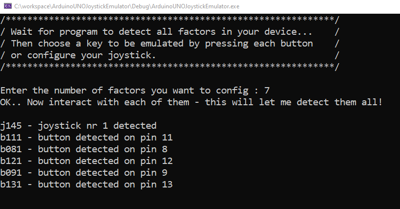
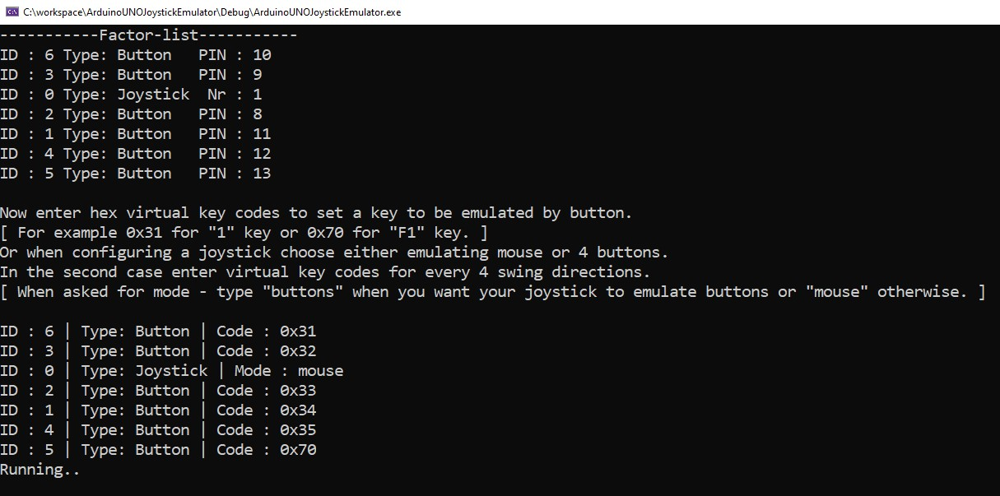

# Arduino gamepad emulator

A program for emulating keyboard or mouse by interacting with componnents connected to Arduino.
It tracks the messages sent via serial port from arduino, recognizes and handle them properly.
Its very easily to set up a bunch of components connected to your arduino like buttons, switches, joystick
with my library [Gamepad-Library](https://github.com/09pawel0898/arduino-gamepad-lib "Gamepad-Library") and then to assign actions to them using this program.
The biggest disadvantage is a requirement to have it running in the background of the game..
But in some cases it can be very useful, especially when working with cheap arduino clones, or arudino types
which are not acting as a HID device. Then using most common joystick libraries may be problematic for 
some people or even impossible.

## How it does its job

The application allows you to assign actions to components connected to your arduino.
It requires the use of Gamepad-Library mentioned above. The library is responsible for sending messages
that describe components states from arduino to PC, and the application is intended to handle those messages, and to perform
appropriate actions. The way it does it is pretty simple. I used two functions provided in <windows.h> library - 
[SetCursorPos](https://docs.microsoft.com/en-us/windows/win32/api/winuser/nf-winuser-setcursorpos "SetCursorPos") 
[keybd_event](https://docs.microsoft.com/en-us/windows/win32/api/winuser/nf-winuser-keybd_event "keybd_event")
The first to handle mouse movement, and the second to handle key pressing.

### Available behaviours and their equivalents :

Button Pressed/Button Released <--> Key pressed/Key released

Joystick swing <--> Can emulate either mouse(4 velocities, depending on the swing angle)                  
Or 4 buttons(Key X pressed/Key X released).

## Building the project

Start by cloning the repository with `git clone https://github.com/09pawel0898/arudino-gamepad-emulator.git`.
Then run generate_project.bat for Visual Studio 2019 project generation, launch *.sln file and build solution.

Exe file is also provided in "executable" folder.

## References

  [Serial-Port](https://github.com/manashmandal/SerialPort "Serial-Port")  - C++ Library for Serial Communication
  
  [json](https://github.com/nlohmann/json "json")
  
  [Benjijart](https://www.youtube.com/watch?v=EkzCk_oesJk "Benjijart") - This video inspired me to do this application, 
  he presented a similar program but without any options for customization.
  
## Screenshoots

## To do
* Saving and reading settings
