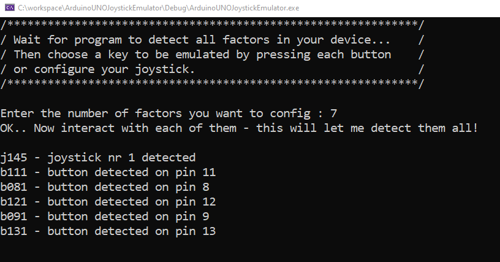
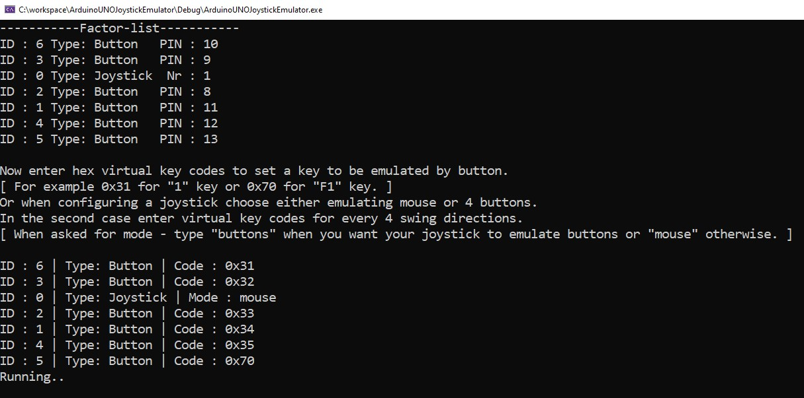

# Arduino gamepad emulator

A program for emulating keyboard or mouse by interacting with componnents connected to Arduino.
It tracks the messages sent via serial port from arduino, recognizes and handle them properly.
Its very easily to set up a bunch of components connected to your arduino like buttons, switches, joystick
with my library [Gamepad-Library](https://github.com/09pawel0898/arduino-gamepad-lib "Gamepad-Library") and then to assign actions to them using this program.
The biggest disadvantage is a requirement to have it running in the background of the game..
But in some cases can be very useful, especially when working with cheap arduino clones, or arudino types
which are not acting as a HID device. Then using most common joystick libraries may be problematic for 
some people.

## Screenshoots

